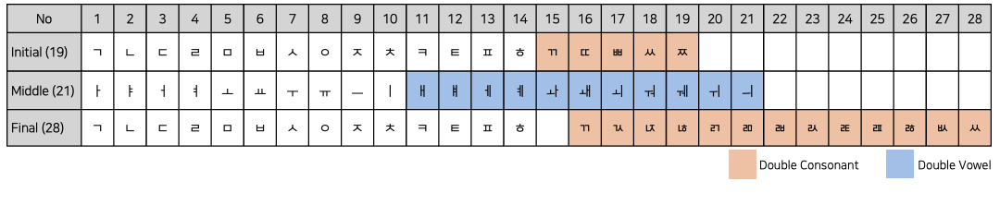
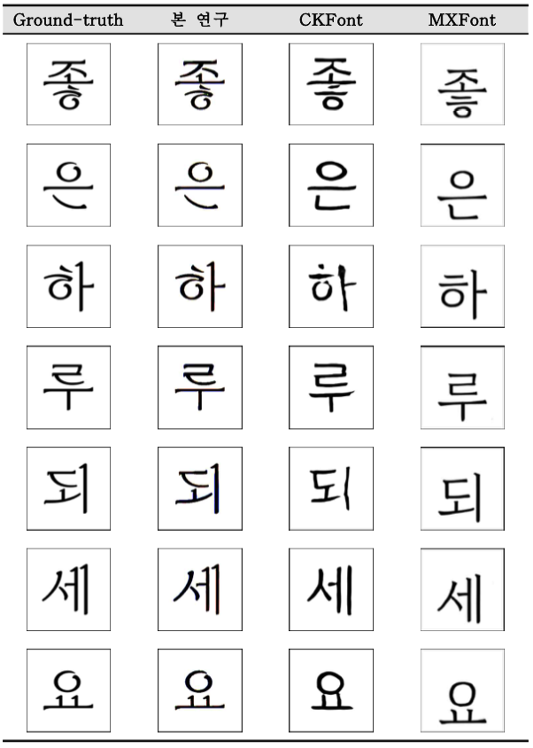
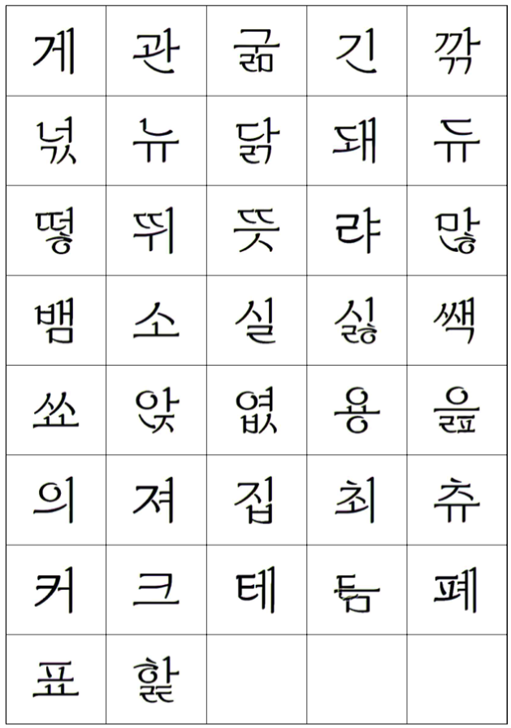
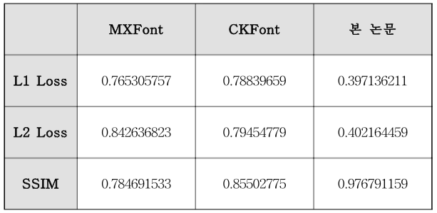

# 한글 생성 모델의 정확도 향상을 위한 구성요소 분리

<br/>
<br/>

## Introduction

한글은 초성 19개, 중성 21개, 종성 28개(없음 포함)로 조합하여 만들 수 있는 총 글자 수는 11,172이다. 이는 한글 폰트 디자이너가 직접 작업할 경우 많은 시간과 비용이 소요되므로 딥러닝을 통해 해결하고자 한다. 빠른 속도로 발전하는 기술로 인해 성능과 정확도가 향상되었으나 그 한계점은 여전히 존재한다. 따라서 본 논문은 한글 구성요소의 조합성에 중점을 둔 실험을 성공적으로 마쳤음에 따라 위치 정보를 이용한 데이터셋을 통해 한글 생성 모델의 성능 향상을 위한 중요한 방향을 제공하며 향후 한글 생성 연구에 기여할 것으로 기대한다.

<br/>

The total number of letters that can be created in Hangul by combining 19 initial consonants, 21 middle consonants, and 28 final consonants (including none) is 11,172. This is something that we want to solve through deep learning, as it takes a lot of time and money for Korean font designers to work on their own. Performance and accuracy have improved due to rapidly developing technology, but limitations still exist. Therefore, as this paper successfully completed an experiment focusing on the combinability of Hangul components, it provides important directions for improving the performance of Hangul generation models through a dataset using location information and is expected to contribute to future Hangul generation research do.

<br/>

#### 1) Overview


<br/>

#### 2) Korean Components


<br/>

#### 3) Korean Combination Type


<br>
<br>

## Prerequisites

🛠️ In Progress: Modify framework from Tensorflow to PyTorch 

* Ubuntu 22.04.3 LTS
* NVIDIA GeForce RTX 2080 Ti 
* Python 3.9.13
* Tensorflow-gpu 1.15

```
conda create --name decompose python=3.9.13
conda activate decompose
pip install -r requirements.txt
```

<br>
<br>

## Datasets

#### 1) Generate Korean Font Images

```
# change directory to datasets

# generate content images
python datasets/font2img.py --label_file datasets/characters/50characters.txt --font_dir datasets/fonts/source --output_dir datasets/images/source

# generate target images
python datasets/font2img.py --label_file datasets/characters/50characters.txt --font_dir datasets/fonts/target --output_dir datasets/images/target --start_idx 1
```

<br>

#### 2) Separate Components


```
python datasets/separator/separator-1type.py
python datasets/separator/separator-2type.py
python datasets/separator/separator-3type.py
python datasets/separator/separator-4type.py
python datasets/separator/separator-5type.py
python datasets/separator/separator-6type.py
```

<br/>

#### 3) Combine Separated Components for Training

```
python datasets/combine.py
```

<br/>

#### 4) Modify filename to sequential number for train

```
python datasets/name-modify.py
```

<br/>

#### 5) Transfer from images to tfrecords

```
python datasets/img2tfrecord.py 
```

<br/>
<br/>

## Train

```
python main.py --mode train --output_dir trained_model --max_epochs 500
```

<br/>
<br/>

## Test(Generate)

```
python main.py --mode test --output_dir result --checkpoint trained_model
```

<br/>
<br/>

## Result

<br/>

<b>1) Generated result sample</b>
<br/>
<div align='center'>
    
</div>

<br/>

<b>2) Generated result sample (unseen font style, seen characters)</b>
<br/>
<div align='center'>
    
</div>

<br/>

<b>3) Values of Loss, SSIM, FID </b>
<br/>
<div align='center'>
    
</div>

<br/>
<br/>
<br/>
<br/>
<br/>

<div align='center'>
    Copyright. 92berra 2024
</div>